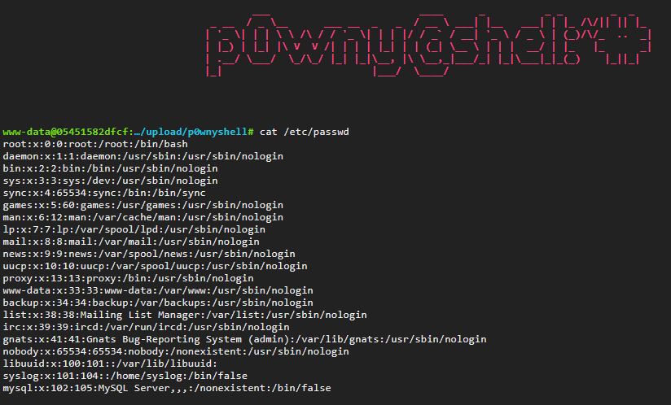

# Дипломная работа по профессии «Специалист по информационной безопасности» (SIB-46, Track Penetration Testing)

## Задача

Протестировать сервис на безопасность методом чёрного ящика.\
Адрес тестируемого приложения — 92.51.39.106.

## Этап 1. Разведка

Для получения информации о предоставленном IP адресе 92.51.39.106 были использованы следующие сервисы:

- [Shodan](https://https://www.shodan.io)
- [ZoomEye](https://www.zoomeye.ai/)
- [CriminalIP](https://www.criminalip.io/)
- [Censys Platform](https://platform.censys.io)
  
В ходе разведки была получена следующая информация об IP адресе:


Местонахождение сервера - Россия, Санкт-Петербург\
Координаты - 59.93863, 30.31413\
Версия ОС - Ubuntu Linux 20.04\
Открытые порты с установленным ПО:
- 22/SSH - OpenBSD OpenSSH 8.2
- 8050/HTTP - веб-сайт NetologyVulnApp.com, веб-сервер Apache HTTPD 2.4.7, язык PHP 5.5.9
- 7788/HTTP - веб-сайт Beemers, веб-сервер TornadoServer 5.1.1

<details>
<summary><b>Скриншоты открытых портов</b></summary>


</details>

<details>
<summary><b>Скриншоты главных страниц обнаруженных сайтов</b></summary>


</details>

### Аналитика собранных данных

Основываясь на полученной в ходе разведки информации, на данном этапе можно провести первичный анализ тестируемого приложения и определить вероятные цели для атаки:

- http://92.51.39.106:8050 - сервис NetologyVulnApp.com, запущенный на веб-сервере Apache HTTPD 2.4.7 (ДОПОЛНИТЬ УЯЗВИМОСТИ);
- http://92.51.39.106:7788 - сервис Beemer, запущенный на веб-сервере TornadoServer 5.1.1 (ДОПОЛНИТЬ УЯЗВИМОСТИ)
- OPENSSH?
- использование сервисами NetologyVulnApp и Beemer соединения HTTP, данный протокол не является безопасным, т.к. передаёт данные в открытом (нешифрованном) виде;
- сервис NetologyVulnApp генерирует сессионные cookie PHPSESSID, для которых не установлены флаги HttpOnly, Secure, SameSite - это потенциальный вектор для XSS и Session Hijacking атак.


## Этап 2. Сканирование

Для сканирования хоста использовались Open Source инструменты Nmap, Dirsearch, OWASP ZAP.

**Nmap**

```sh
$ nmap -sV -T4 -p 22,8050,7788 --script vulners 92.51.39.106
```
Описание команды:

-sV - определение служб и их версий;\
-T4 - агрессивный профиль сканирования;\
-p 22,7788,8050 - список портов для сканирования;\
--script vulners - подключение скрипта для определения уязвимостей.

[Результат сканирования хоста 92.51.39.106](assets/nmap_scan_results.txt)

**Dirsearch**

```sh
$ dirsearch -u http://92.51.39.106:8050 --cookie="PHPSESSID=ccltoo7k0vvc7drerrosabjnp2" 
```
[Результат сканирования сервиса NetologyVulnApp](assets/dirsearch_8050.txt)

```sh
$ dirsearch -u http://92.51.39.105:7788 
```
[Результат сканирования сервиса Beemers](assets/dirsearch_7788.txt)

По результатам проведенного сканирования можно выделить следующие проблемы безопасности:

- неустановленные флаги `HttpOnly`, `Secure` у сессионной cookie PHPSESSID + нет привязки сессии к устройству - потенциал для XSS, CSRF атак;
- отсутствие header'a `X-frame-Options` - возможная уязвимость Clickjacking;
- включена индексация директорий - возможность эксплуатации уязвимости Path Traversal, внедрения shell-скриптов, изучения файлов приложения, конфигураций, паролей и т.д.

## Этап 3. Тестирование

Приложение тестировалось вручную и с помощью автоматического сканера уязвимостей OWASP ZAP.

**Результаты автоматического сканирования сервиса NetologyVulnApp:**


**Результаты автоматического сканирования сервиса Beemer:**


По результатам автоматического тестирования были выявлены следующие уязвимости по уровню критичности:

- $${\color{red}Высокий \ уровень}$$
  - Cross site scripting (DOM based);
  - Cross site scripting (Persistent);
  - Cross site scripting (Reflected);
  - SQL Injection;
  - Path Traversal;
  - Remote OS Command Injection.

- $${\color{orange}Средний \ уровень}$$
  - отсутствие токенов против CSRF-атак;
  - не установлен хедер Content Security Policy (CSP);
  - включена индексация директорий;
  - отсутствие хедера для защиты от clickjacking-атак;
  - использование уязвимой JS библиотеки.
  
- $${\color{olive}Низкий \ уровень}$$
  - Cookie без установленных параметров SameSite, HttpOnly;
  - отсутствие хедера X-Content-Type;
  - утечки информации о сервере через поля заголовка X-Powered-By;
  - утечки информации о версиях ПО через поля заголовка Server;
  - отсутствие хедера Strict-Transport-Security.

---
  
$${\color{red}Результаты \ ручного \ тестирования \ сервиса \ NetologyVulnApp:}$$

1. **Уязвимость SQL Injection**

**Категория:** [A03:2021-Injection](https://owasp.org/Top10/A03_2021-Injection/)\
**Страница:** `http://92.51.39.106:8050/users/login.php`\
**Критичность:** Высокая\
**Описание:** На странице существует возможность внедрения SQL-инъекции в поле `Username`, эта уязвимость даёт потенциальную возможность добавлять, изменять и удалять данные в таблицах БД.\
**Рекомендации для исправления:** Внедрение механизмов валидации и санитизации пользовательского ввода в форме авторизации.

<details>
<summary><b>Реализация (Proof of Concept)</b></summary>

- выполнить переход на уязвимую страницу `http://92.51.39.106:8050/users/login.php`;
- в поле `Username` ввести `' OR 1=1 -- -'`;
- поле `Password` заполнить любой комбинацией символов.


Запрос выполняется корректно, происходит успешная авторизация под учетной записью пользователя `Sample User`:


</details>

---

2. **Слабые логин и пароль администратора**

**Категория:** [A07:2021-Identification and Authentication Failures](https://owasp.org/Top10/A07_2021-Identification_and_Authentication_Failures/)\
**Страница:** `http://92.51.39.106:8050/admin/index.php?page=login`\
**Критичность:** Высокая\
**Описание:** Учетные данные администратора сайта `admin/admin` являются слабыми, существует возможность получения несанкционированного доступа к панели администратора.\
Функционал панели на текущий момент состоит только из функции создания нового пользователя, которая на текущий момент до конца не реализована или вовсе отключена. Однако нельзя исключать возможность реализации функционала в будущем.\
Например, если будет реализован механизм наделения нового пользователя какими-либо полномочиями, то уязвимая панель администратора может привести к появлению нового (несанкционированного) администратора, что в дальнейшем может грозить потерей доступа к панели для настоящего администратора (в случае если его УЗ можно будет удалить или лишить полномочий).\
**Рекомендации для исправления:** Использование более сложного пароля и нетипичных имен для УЗ администратора.

<details>
<summary><b>Реализация (Proof of Concept)</b></summary>

- выполнить переход на уязвимую страницу `http://92.51.39.106:8050/admin/index.php?page=login`;
- в форму ввода ввести логин/пароль `admin/admin`.


После успешного выполнения запроса происходит авторизация под УЗ администратора:


При попытке использовать панель администратора (функция `Create a new user!`) получаем ошибку `No such file or directory`, сработавшую на вызов файла `create.php` что говорит о том, что функционал либо до конца не реализован, либо временно отключен.


</details>

---

3. **Уязвимость к атакам BruteForce**

**Категория:** [A07:2021-Identification and Authentication Failures](https://owasp.org/Top10/A07_2021-Identification_and_Authentication_Failures/)\
**Страница:**`http://92.51.39.106:8050/users/login.php`\
**Критичность:** Средняя\
**Описание:** на странице существует возможность выполнения атак методом "грубой силы" (BruteForce), т.к. не установлен лимит на попытки ввода пары логин/пароль.\
**Рекомендации для исправления:** установление ограничения попыток ввода пары логин/пароль и внедрение механизма ограничения попыток авторизации по IP-адресу.

<details>
<summary><b>Реализация (Proof of Concept)</b></summary>

Зарегистрируем на сайте тестового пользователя `hackme` с присвоенным паролем `password`:


При попытке авторизации под учетной записью нового пользователя `hackme` намеренно вводим некорректный пароль для просмотра сообщения ошибки, которую отправляет сервер в ответ на некорректный пользовательский ввод. Это сообщение будет использовано в инструменте Hydra в качестве шаблона ответа сервера, чтобы отличить неуспешные попытки входа от успешных.\
В данном примере фразой отказа будет являться `The username/password combination you have entered is invalid`:


Используем инструмент Hydra для подбора пароля пользователя `hackme`:

```sh
hydra -l hackme -P "/home/kali/Downloads/rockyou.txt" -s 8050 92.51.39.106 http-post-form "/users/login.php:username=hackme&password=^PASS^:F=The username/password combination you have entered is invalid" -f
```

Спустя некоторое время получаем валидную пару логин/пароль:


</details>

---

4. **Уязвимость Path Traversal**

**Категория:** [A01:2021-Broken Access Control](https://owasp.org/Top10/A01_2021-Broken_Access_Control/)\
**Страница:** `http://92.51.39.106:8050/admin/index.php?page=login`\
**Критичность:** Высокая\
**Описание:** На странице есть возможность взаимодействия с файловой системой через GET-параметр запроса.\
**Рекомендация для исправления:** Валидация значений параметров запросов.

<details>
<summary><b>Реализация (Proof of Concept)</b></summary>

- выполнить переход на страницу `http://92.51.39.106:8050/admin/index.php?page=login`;
- значение параметра `page=login` заменить на `page=php://filter/read=convert.base64-encode/resource=../users/login`;
- получаем зашифрованный код страницы в `base64`:


То же в текстовом формате:

```sh
PD9waHANCg0KcmVxdWlyZV9vbmNlKCIuLi9pbmNsdWRlL3VzZXJzLnBocCIpOw0KcmVxdWlyZV9vbmNlKCIuLi9pbmNsdWRlL2h0bWxfZnVuY3Rpb25zLnBocCIpOw0KcmVxdWlyZV9vbmNlKCIuLi9pbmNsdWRlL2Z1bmN0aW9ucy5waHAiKTsNCg0KLy8gbG9naW4gcmVxdWlyZXMgdXNlcm5hbWUgYW5kIHBhc3N3b3JkIGJvdGggYXMgUE9TVC4gDQokYmFkX2xvZ2luID0gIShpc3NldCgkX1BPU1RbJ3VzZXJuYW1lJ10pICYmIGlzc2V0KCRfUE9TVFsncGFzc3dvcmQnXSkpOw0KaWYgKGlzc2V0KCRfUE9TVFsndXNlcm5hbWUnXSkgJiYgaXNzZXQoJF9QT1NUWydwYXNzd29yZCddKSkNCnsNCiAgIGlmICgkdXNlciA9IFVzZXJzOjpjaGVja19sb2dpbigkX1BPU1RbJ3VzZXJuYW1lJ10sICRfUE9TVFsncGFzc3dvcmQnXSwgVHJ1ZSkpDQogICB7DQogICAgICBVc2Vyczo6bG9naW5fdXNlcigkdXNlclsnaWQnXSk7DQogICAgICBpZiAoaXNzZXQoJF9QT1NUWyduZXh0J10pKQ0KICAgICAgew0KCSBodHRwX3JlZGlyZWN0KCRfUE9TVFsnbmV4dCddKTsNCiAgICAgIH0NCiAgICAgIGVsc2UNCiAgICAgIHsNCgkgaHR0cF9yZWRpcmVjdChVc2Vyczo6JEhPTUVfVVJMKTsNCiAgICAgIH0NCiAgIH0NCiAgIGVsc2UNCiAgIHsNCiAgICAgICRiYWRfbG9naW4gPSBUcnVlOw0KICAgICAgJGZsYXNoWydlcnJvciddID0gIlRoZSB1c2VybmFtZS9wYXNzd29yZCBjb21iaW5hdGlvbiB5b3UgaGF2ZSBlbnRlcmVkIGlzIGludmFsaWQiOw0KICAgfQ0KfQ0KaWYgKCRiYWRfbG9naW4pDQp7DQogICBvdXJfaGVhZGVyKCk7DQoNCiAgID8+DQoNCjxkaXYgY2xhc3M9ImNvbHVtbiBwcmVwZW5kLTEgc3Bhbi0yMyBmaXJzdCBsYXN0Ij4NCiAgICA8aDI+TG9naW48L2gyPg0KICAgIDw/cGhwIGVycm9yX21lc3NhZ2UoKTsgPz4NCiAgICA8dGFibGUgc3R5bGU9IndpZHRoOjMyMHB4IiBjZWxsc3BhY2luZz0iMCI+DQogICAgICA8Zm9ybSBhY3Rpb249Ijw/PWgoICRfU0VSVkVSWydQSFBfU0VMRiddICk/PiIgbWV0aG9kPSJQT1NUIj4NCiAgICAgIDx0cj48dGQ+VXNlcm5hbWUgOjwvdGQ+PHRkPiA8aW5wdXQgdHlwZT0idGV4dCIgbmFtZT0idXNlcm5hbWUiIC8+PC90ZD48L3RyPg0KICAgICAgPHRyPjx0ZD5QYXNzd29yZCA6PC90ZD48dGQ+IDxpbnB1dCB0eXBlPSJwYXNzd29yZCIgbmFtZT0icGFzc3dvcmQiIC8+PC90ZD48L3RyPg0KICAgICAgPHRyPjx0ZD48aW5wdXQgdHlwZT0ic3VibWl0IiB2YWx1ZT0ibG9naW4iIC8+PC90ZD48dGQ+IDxhIGhyZWY9Ii91c2Vycy9yZWdpc3Rlci5waHAiPlJlZ2lzdGVyPC9hPjwvdGQ+PC90cj4NCiAgIDwvZm9ybT4NCiA8L3RhYmxlPg0KPC9kaXY+DQogICA8P3BocA0KDQogICAgICAgb3VyX2Zvb3RlcigpOw0KfQ0KDQoNCj8+
```

- с помощью дешифровщиков получаем php-код страницы:

```sh
<?php

require_once("../include/users.php");
require_once("../include/html_functions.php");
require_once("../include/functions.php");

// login requires username and password both as POST. 
$bad_login = !(isset($_POST['username']) && isset($_POST['password']));
if (isset($_POST['username']) && isset($_POST['password']))
{
   if ($user = Users::check_login($_POST['username'], $_POST['password'], True))
   {
      Users::login_user($user['id']);
      if (isset($_POST['next']))
      {
	 http_redirect($_POST['next']);
      }
      else
      {
	 http_redirect(Users::$HOME_URL);
      }
   }
   else
   {
      $bad_login = True;
      $flash['error'] = "The username/password combination you have entered is invalid";
   }
}
if ($bad_login)
{
   our_header();

   ?>

<div class="column prepend-1 span-23 first last">
    <h2>Login</h2>
    <?php error_message(); ?>
    <table style="width:320px" cellspacing="0">
      <form action="<?=h( $_SERVER['PHP_SELF'] )?>" method="POST">
      <tr><td>Username :</td><td> <input type="text" name="username" /></td></tr>
      <tr><td>Password :</td><td> <input type="password" name="password" /></td></tr>
      <tr><td><input type="submit" value="login" /></td><td> <a href="/users/register.php">Register</a></td></tr>
   </form>
 </table>
</div>
   <?php

       our_footer();
}

?>
```

</details>

---

5. **Уязвимость Unrestricted File Upload**

**Категория:** [A01:2021-Broken Access Control](https://owasp.org/Top10/A01_2021-Broken_Access_Control/)\
**Страница:** `http://92.51.39.106:8050/pictures/upload.php`\
**Критичность:** Высокая\
**Описание:** На странице, по замыслу предназначенной для загрузки картинок, есть возможность загрузки произвольного файла, например, возможна загрузка PHP-shell.\
**Рекомендация для исправления:** Валидация загружаемых файлов по типу содержимого.

<details>
<summary><b>Реализация (Proof of Concept)</b></summary>

- выполнить переход на уязвимую страницу `http://92.51.39.106:8050/pictures/upload.php`;
- в открывшейся форме для загрузки картинок заполнить необходимые поля, выбрать для загрузки заранее подготовленный файл [PHP-shell](assets/shell.php) (данный shell был найден на [Github](https://github.com/flozz/p0wny-shell/tree/master)), нажать кнопку `Upload File`:


После успешной загрузки будет отображена страница с загруженным файлом, но картинка отображаться не будет, т.к. загруженный файл не является картинкой:


- используя уязвимость `Path Traversal`, выявленную на предыдущем этапе, переходим на уязвимую страницу `http://92.51.39.106:8050/upload/` для просмотра содержимого папки `upload` и находим путь до загруженного PHP-shell:


- переходим по пути `http://92.51.39.106:8050/upload/p0wnyshell/shell.php` и получаем доступ к PHP-shell под пользователем `www-data`:


- выполняем команду `cat /etc/passwd` и получаем от сервера информацию:



- так же есть возможность просмотреть исходные коды работающего приложения, например, код страницы, выявленный в ходе эксплуатации уязвимости `Path Traversal` на предыдущем этапе, можно просмотреть командой `cat /app/users/login.php`:


</details>

---

6. **Уязвимость OS Command Injection с развитием в Denial of Service (DoS)**

**Категория:** [A03:2021-Injection](https://owasp.org/Top10/A03_2021-Injection/) и [A05:2021-Security Misconfiguration](https://owasp.org/Top10/A05_2021-Security_Misconfiguration/)\
**Страница:** `http://92.51.39.106:8050/passcheck.php`\
**Критичность:** Высокая\
**Описание:** На странице реализован функционал проверки надёжности пароля. Пароль проверяется путём сравнения со списком паролей в операционной системе по пути `/etc/dictionaries-common/words`.\
**Рекомендация для исправления:** экранирование и санитизация пользовательского ввода.

<details>
<summary><b>Реализация (Proof of Concept)</b></summary>

- перейти на страницу `http://92.51.39.106:8050/passcheck.php`;
- в поле `Password to check` задать любой пароль для проверки, в примере использован пароль `password`;
- после выполнения запроса в интерфейсе приложения появится используемая команда:


- в случае отправки на сервер запроса с прибавлением к пользовательскому вводу специальных символов для образования конвейера команд (например, `password | ls`) можно вызвать временную недоступность сайта - это реализация атаки Denial of Service.

Ответ сервера (код 200) при обычном пользовательском вводе:


и при эксплуатации уязвимости нет статус-кода, сайт виснет на какое-то время:


</details>

---

7. **Уязвимость XSS**

**Категория:** [A03:2021-Injection](https://owasp.org/Top10/A03_2021-Injection/)\
**Страницы:** `http://92.51.39.106:8050/guestbook.php`, `http://92.51.39.106:8050/piccheck.php`, `http://92.51.39.106:8050/pictures/search.php?query=`, `http://92.51.39.106:8050/pictures/view.php?picid=`\
**Критичность:** Высокая\
**Описание:** На перечисленных страницах существует возможность добавления пользовательского ввода без санитизации.
**Рекомендация для исправления:** Санитизация и экранирование пользовательского ввода.

<details>
<summary><b>Реализация (Proof of Concept)</b></summary>

Для `http://92.51.39.106:8050/piccheck.php`:

- на главной странице сайта в поле `With this name` добавить `#">`, нажать кнопку `Send file`:


- после выполнения запроса произойдёт перенаправление на страницу `http://92.51.39.106:8050/piccheck.php`, на которой отобразится всплывающее окно с сессионной cookie:


Для `http://92.51.39.106:8050/pictures/search.php?query=`:

- на любой странице сайта, где имеется поле `Search` ввести пользовательский ввод `#">`, нажать кнопку `Search`:


- будет выполнен переход на страницу `http://92.51.39.106:8050/pictures/search.php?query=`, на которой отобразится всплывающее окно с сессионной cookie:


Для `http://92.51.39.106:8060/guestbook.php`:

- на странице `http://92.51.39.106:8050/guestbook.php` заполнить поля `Name` и `Comment`:


- на странице появится введенный коментарий и всплывет окно с сессионной cookie:


Для `http://92.51.39.106:8050/pictures/view.php?picid=`:

- выполнить переход на страницу любой картинки на вкладке `Recent`, у каждой картинки есть секция для комментариев:


- заполнить поле `Add your comment` пользовательским вводом `#">`, нажать кнопку `Preview`:


- отобразится предварительный просмотр комментария, нажать кнопку `Create`:


- на странице появится всплывающее окно с сессионной cookie:


</details>

---

$${\color{red}Результаты \ ручного \ тестирования \ сервиса \ Beemer:}$$

1. **Уязвимость OS Command Injection**

**Категория:** [A03:2021-Injection](https://owasp.org/Top10/A03_2021-Injection/)\
**Страница:** `http://92.51.39.106:7788/server.html`\
**Критичность:** Высокая\
**Описание:** На данной странице реализован функционал проверки доступности хоста (используется команда `ping`), чей IP-адрес будет введён в форму. Однако пользовательский ввод на санитизируется, есть возможность исполнять команды, используя конвейер команд.\
**Рекомендация для исправления:** Санитизация/экранирование пользовательского ввода.

<details>
<summary><b>Реализация (Proof of Concept)</b></summary>

- выполнить переход на уязвимую страницу `http://92.51.39.106:7788/server.html`;
- в поле после IP-адреса дополнить команду `& cat /etc/passwd`, нажать кнопку `Check`;
- в результате выполнения запроса помимо выполнения команды `ping` будет выдано содержимое файла `/etc/passwd`:


- кроме этого, использовав команду `whoami`, можно увидеть, что приложение работает под `root`-правами, следовательно воздействие на сервер не ограничено:


- так, например, прописав в поле `127.0.0.1 & cat /code/server.py` можно посмотреть код приложения, написанного на языке `Python`, и заодно увидеть какие пользователи заводятся в таблицу при запуске приложения:


</details>

---

2. **Уязвимость SQL Injection**

**Категория:** [A03:2021-Injection](https://owasp.org/Top10/A03_2021-Injection/)\
**Страница:** `http://92.51.39.106:7788/login.html`\
**Критичность:** Высокая\
**Описание:** Форма авторизации уязвима к SQL-инъекциям через поле "Username".\
**Рекомендация для исправления:** Санитизация, экранирование пользовательского ввода.

<details>
<summary><b>Реализация (Proof of Concept)</b></summary>

Эксплуатируя ранее уязвимость OS Command Injection, узнаем, что выборка пользователей осуществляется следующим образом:


Происходит сравнение введенного логина и пароля в форме с данными в БД, при совпадении происходит авторизация, при несовпадении приходит ответ о неудачной попытке входа `Login Failed`.\
При этом пользовательский код не санитизируется и не экранируется, таким образом можно попробовать внедрить SQL-инъекцию в форму авторизации:

- выполнить переход на уязвимую страницу `http://92.51.39.106:7788/login.html`;
- в поле `Username` ввести `admin' --` и любые символы в поле `Password` (логин и пароль администратора, как и других пользователей, известны с этапа эксплуатации уязвимости OS Command Injection);

После успешной авторизации будет выведено сообщение:


</details>

---

3. **Уязвимость к атакам BruteForce**

**Категория:** [A07:2021-Identification and Authentication Failures](https://owasp.org/Top10/A07_2021-Identification_and_Authentication_Failures/)\
**Страница:** `http://92.51.39.106:7788/login.html`\
**Критичность:** Средняя\
**Описание:** На странице существует возможность проведения BruteForce атак, т.к. не установлен лимит на попытки ввода данных в форму авторизации.\
**Рекомендация для исправления:** Установление ограничения попыток ввода пары логин/пароль и внедрение механизма ограничения попыток авторизации по IP-адресу.

<details>
<summary><b>Реализация (Proof of Concept)</b></summary>

Используем атаку по словарю с паролями с заранее известным логином `admin`:

```sh
hydra -l admin -P "/home/kali/Downloads/passwords.txt" -s 7788 92.51.39.106 http-post-form "/login.html:username=admin&password=^PASS^:F=Login Failed" -f
```

Через некоторое время находим валидную пару `admin/admin`:


</details>

---

4. **Уязвимость XSS**

**Категория:** [A03:2021-Injection](https://owasp.org/Top10/A03_2021-Injection/)\
**Страница:** `http://92.51.39.106:7788/search?q=`
**Критичность:** Высокая
**Описание:** На странице существует возможность добавления пользовательского ввода без санитизации.
**Рекомендация для исправления:** Экранирование и санитизация пользоватеьского ввода.

<details>
<summary><b>Реализация (Proof of Concept)</b></summary>

- добавить пользовательский ввод `#">` в поле `Search Something` на главной странице сайта;
- после выполнения запроса произойдёт перенаправление на уязвимую страницу `http://92.51.39.106:7788/search?q=`, на которой отобразится всплывающее окно с сессионной cookie:


</details>

---

5. **Уязвимость Path Traversal**

**Категория:** [A01:2021-Broken Access Control](https://owasp.org/Top10/A01_2021-Broken_Access_Control/)\
**Страница:** `http://92.51.39.106:7799/read?file=`\
**Критичность:** Высокая\
**Описание:** На странице существует возможность взаимодействия с файловой системой через GET-параметр запроса.\
**Рекомендация для исправления:** Валидация значений параметров запросов.

<details>
<summary><b>Реализация (Proof of Concept)</b></summary>

- перейти на страницу `http://92.51.39.106:7799/read?file=../../../../../../etc/passwd`;
- сервер отобразит содержимое файла `/etc/passwd`:


</details>

---

**Категория:**
**Страница:**
**Критичность:**
**Описание:**
**Рекомендация для исправления:**

<details>
<summary><b>Реализация (Proof of Concept)</b></summary>

</details>

---

## Этап 4. Выводы

